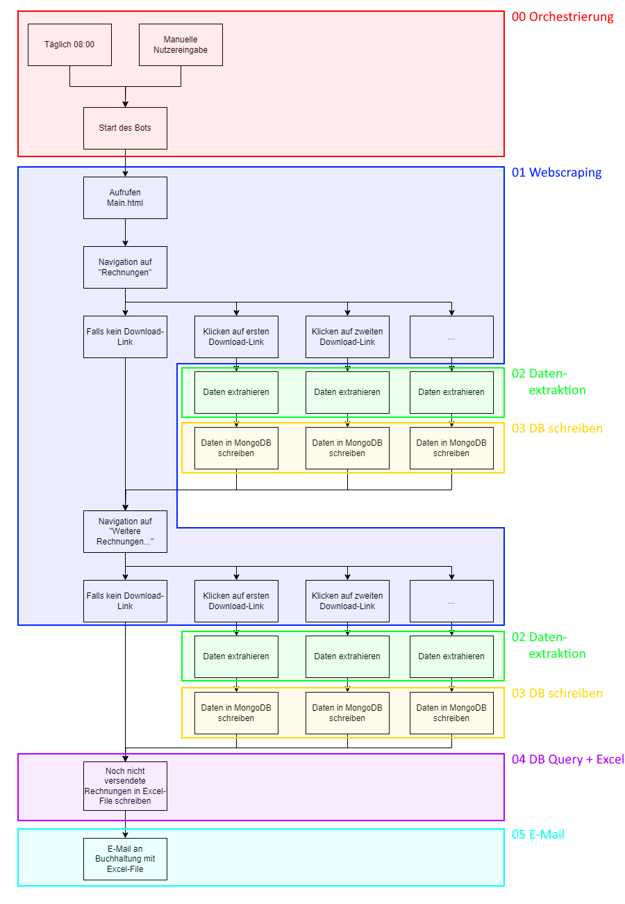

# Willkommen auf dem GitHub unseres RPA-Projekts!

Dieses Repository wurde einerseits für die Versionenkontrolle und die kollaborative Mitarbeit des Teams genutzt und dient andererseits als Wekzeug zur Präsentation und Abgabe der Resultate.

    
    
<em>RPA-Bot (generiert mit MidJourney)</em>

_____________________________

## Demo-Video

Die funktionierende Automatisierung wird in einer Demo vorgestellt:
[Link zum Demo-Video](https://photos.onedrive.com/share/3083D8FE9F20F472!600763?cid=3083D8FE9F20F472&resId=3083D8FE9F20F472!600763&authkey=!AGHJWZlXzTnmB2M&ithint=video&e=FbJku4)

_____________________________

## Überblick

- [UiPath](UiPath) - Code des Projekts.
- [Requirements](Dokumente/Requirements.pdf) - Aufzählung, was für die Ausführung der Automatisierung benötigt wird.
- [Beispiel Logfile](Dokumente/Beispiel_Logfile.txt) - Zur Veranschaulichung, das Logfile einer erfolgreichen Durchfürhung.
- [Architekturmodell](Dokumente/Architekturmodell.pdf) - Beschreibung des Architekturmodells.
- [Architekturtestspezifikation](Dokumente/Architekturtestspezifikation.pdf) - Testspezifikationen zur Architektur.
- [Datenmodell](Dokumente/Datenmodell.pdf) - Beschreibung des Datenmodells.
- [Datentestspezifikation](Dokumente/Datentestspezifikation.pdf) - Testspezifikationen zu den Daten.
- [Codemodell](Dokumente/Codemodell.pdf) - Beschreibung des Codemodells.
- [Codetestspezifikation](Dokumente/Codetestspezifikation.pdf) - Testspezifikationen zum Code

_____________________________

## Beschreibung des Projekts

Die fünf Hauptaufgaben der Automatisierung wurden in Separaten Workflow-Sequenzen implementiert. Der Main-Workflow ruft die fünf Frequenzen auf:

**Sequenz 01 "get_pdf"** - Webscraping aller PDF-Rechnungen.  
**Sequenz 02 "read_pdf"** - Extraktion der relevanten Rechnungsdaten mit *generative AI*. Wir nutzen die OpenAI API mit dem ChatGPT 4.o Modell, um die Rechnungsdaten in einem JSON-Format zu speichern.  
**Sequenz 03 "write_db"** - Die Rechnungsdaten werden in eine MongoDB geschrieben. Ist die Rechnung bereits abgelegt, wird sie nicht nochmals hinzugefügt.  
**Sequenz 04 "read_db_to_excel"** - Die Rechnungen, welche noch nicht verschickt wurden, werden ermittelt und in einen Excel-Report geschrieben. Sind alle Rechnungen bereits verschickt, wird kein Report erstellt.  
**Sequenz 05 "email"** - Der Excel-Report wird via E-Mail als Attachment verschickt. Falls bereits alle Rechnungen zugestellt sind, wird eine alternative E-Mail zur Information ausgelöst.
  
_____________________________

## Alternative zur Datenextraktion: OLLAMA

Für die Datenextraktion haben wir eine Alternative mit dem lokalen Open-Source-LLM **OLLAMA** implementiert. 

Wir haben für das Endprodukt die OpenAI API verwendet, weil diese im allgemeiner einfacher zu implementieren ist und eine bessere "Plug-and-Play"-Lösung für unsere Automatisierung bietet. Die Einrichtung von OLLAMA war komplexer und hat nicht bei allen Gruppenmitgliedern funktioniert. Nichtsdestotrotz ist OLLAMA eine attraktive Alternative in Hinsicht auf verschiedene Gründe wie Datenschutz, Kosten oder Flexibilität. 

Wir haben deshalb ein [Dokument](Dokumente/OLLAMA_Set_up.pdf) erstellt, welches das Set-up der Lösung mit OLLAMA schildert.

_____________________________
  
## Gruppe 
- Silvano Stupan
- Joshua Kohler
- Daniel Schafhäutle
- Raphael Brunold

_____________________________

## Schematische Darstellung

Diese Abbildung zeigt schematisch den Ablauf unserer Automatisierung:

    

_____________________________