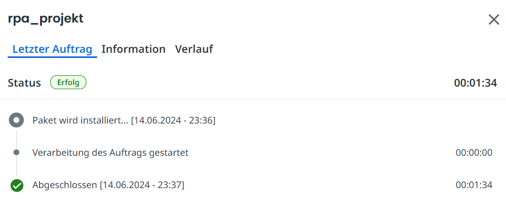

# Willkommen auf dem GitHub unseres RPA-Projekts!

Dieses Repository wurde einerseits für die Versionenkontrolle und die kollaborative Mitarbeit des Teams genutzt und dient andererseits als Werkzeug zur Präsentation und Abgabe der Resultate.

    
    
<em>RPA-Bot (generiert mit MidJourney)</em>

_____________________________

## Demo-Video

Die funktionierende Automatisierung wird in einer Demo vorgestellt:
[Link zum Demo-Video](https://photos.onedrive.com/share/3083D8FE9F20F472!600763?cid=3083D8FE9F20F472&resId=3083D8FE9F20F472!600763&authkey=!AGHJWZlXzTnmB2M&ithint=video&e=FbJku4)

_____________________________

## Überblick

- [UiPath](./UiPath) - Code des Projekts.
- [Requirements](./Dokumente/Requirements.pdf) - Aufzählung, was für die Ausführung der Automatisierung benötigt wird.
- [Beispiel Logfile](./Dokumente/Beispiel_Logfile.txt) - Zur Veranschaulichung: das Logfile einer erfolgreichen Durchführung.
- [OLLAMA Setup](./Dokumente/OLLAMA_Set_up.pdf) (optional) - Tutorial, wie man ein lokales LLM mit OLLAMA aufsetzen kann.
- [Architekturmodell](./Dokumente/Architekturmodell.pdf) - Beschreibung des Architekturmodells.
- [Architekturtestspezifikation](./Dokumente/Architekturtestspezifikation.pdf) - Testspezifikationen zur Architektur.
- [Datenmodell](./Dokumente/Datenmodell.pdf) - Beschreibung des Datenmodells.
- [Datentestspezifikation](./Dokumente/Datentestspezifikation.pdf) - Testspezifikationen zu den Daten.
- [Codemodell](./Dokumente/Codemodell.pdf) - Beschreibung des Codemodells.
- [Codetestspezifikation](./Dokumente/Codetestspezifikation.pdf) - Testspezifikationen zum Code.

_____________________________

## Beschreibung des Projekts

Die fünf Hauptaufgaben der Automatisierung wurden in separaten Workflow-Sequenzen implementiert. Der Main-Workflow ruft die fünf Sequenzen auf:

**Sequenz 01 "get_pdf"** - Webscraping aller PDF-Rechnungen.  
**Sequenz 02 "read_pdf"** - Extraktion der relevanten Rechnungsdaten mit *generative AI*. Wir nutzen die OpenAI API mit dem ChatGPT 4o Modell, um die Rechnungsdaten in einem JSON-Format zu speichern.  
**Sequenz 03 "write_db"** - Die Rechnungsdaten werden in eine MongoDB geschrieben. Ist die Rechnung bereits abgelegt, wird sie nicht nochmals hinzugefügt.  
**Sequenz 04 "read_db_to_excel"** - Die Rechnungen, welche noch nicht verschickt wurden, werden ermittelt und in einen Excel-Report geschrieben. Sind alle Rechnungen bereits verschickt, wird kein Report erstellt.  
**Sequenz 05 "email"** - Der Excel-Report wird via E-Mail als Attachment verschickt. Falls bereits alle Rechnungen zugestellt sind, wird eine alternative E-Mail zur Information ausgelöst.  

**Zur Veranschaulichung für die Demo haben wir Message Boxes mit dem Output der ChatGPT-Response im Code. Diese würden selbstverständlich für eine Live-Umgebung entfernt, damit der Bot vollautomatisiert laufen kann.**

_____________________________

## Orchestrierung
Das Projekt kann im UiPath Studio mit dem Button "Veröffentlichen" (ganz rechts in der Menüleiste) in den Orchestrator geladen werden.  

Anschliessend kann die Installation im Ui Path Assistant abgeschlossen werden.  

Nun kann die Automatisierung komfortabel auf Knopfdruck gestartet werden. 

Im UiPath Assistant kann man unter *weitere Aktionen* (drei Punkte) eine Desktopverknüpfung für den Start der Automatisierung erstellen.  

    

  

Dies können wir im UiPath Assistant oder auch auf dem UiPath Orchestrator machen. Der Orchestrator ist in der UiPath Automation Cloud zu finden ([Login Link](https://www.uipath.com/de/product/automation-cloud)). Eine regelmässige Ausführung kann man unter dem Tab "Trigger" einrichten. Hier können wir auswählen, dass der Bot täglich um 08:00 Uhr automatisch ausgeführt wird. **Somit sind die Anforderungen erfüllt, dass der Bot automatisch täglich und auch auf Knopfdruck ausgelöst werden kann.**

_____________________________

## Alternative zur Datenextraktion: OLLAMA

Für die Datenextraktion haben wir ursprünglich eine Alternative mit einem **lokalen Open-Source Large Language Model** implementiert. **OLLAMA** bietet ein Frontend für das Herunterladen und die Nutzung lokaler Open-Source LLMs.

Wir haben für das Endprodukt die OpenAI API verwendet, weil diese in UiPath im Allgemeinen einfacher zu implementieren ist und eine bessere "Plug-and-Play"-Lösung für unsere Automatisierung bietet. Die Einrichtung von OLLAMA hat nicht bei allen Gruppenmitgliedern einwandfrei funktioniert. Nichtsdestotrotz ist OLLAMA eine attraktive Alternative in Hinsicht auf verschiedene Aspekte wie Datenschutz, Kosten oder Flexibilität.  

Wir haben deshalb ein [Dokument](Dokumente/OLLAMA_Set_up.pdf) erstellt, welches das Set-up der Lösung mit OLLAMA schildert.

_____________________________

## Gruppe 
- Silvano Stupan
- Joshua Kohler
- Daniel Schafhäutle
- Raphael Brunold

_____________________________

## Schematische Darstellung

Diese Abbildung zeigt schematisch den Ablauf unserer Automatisierung:

    

_____________________________

Viel Spass beim Automatisieren!